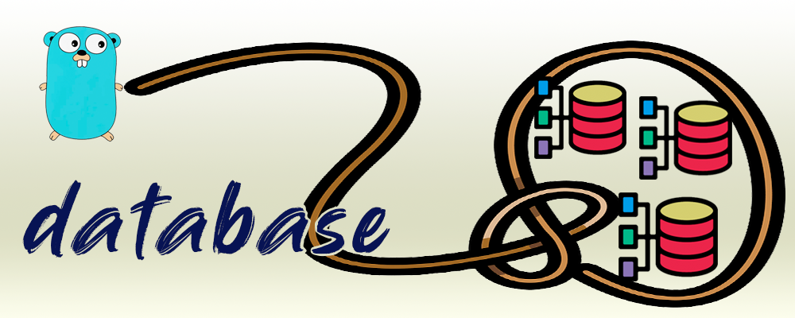

<div align="center" style="margin-bottom:20px">
  
  <div align="center">
    <a href="https://github.com/blugnu/database/actions/workflows/qa.yml"></a>
    <a href="https://goreportcard.com/report/github.com/blugnu/database" ></a>
    <a>= 1.18" src="https://img.shields.io/github/go-mod/go-version/blugnu/database?style=flat-square"/></a>
    <a href="https://github.com/blugnu/database/blob/master/LICENSE"></a>
    <a href="https://coveralls.io/github/blugnu/database?branch=master"></a>
    <a href="https://pkg.go.dev/github.com/blugnu/database"></a>
  </div>
</div>

# blugnu/database

Provides an abstraction over databases supported by the standard library, with the following features:

- connector retries:
    - fail-over connections to mirrored database servers
    - greater resilience to transient errors
- simplified and automated transaction handling
- simplified api


<hr/>

## Connector Retries
Database operations are performed via a `Connection` interface.  When a new `Connection` is initialized it may be provided with multiple `Connector` configurations:

```golang
    cnc, err := database.NewConnection(
        WithConnector(sqlite.Connector{ /* sqlite configuration for connector 1 */ }),
        WithConnector(sqlite.Connector{ /* sqlite configuration for connector 2 */ }),
    )
```

> A `WithConnectors` configuration function is also provided that accepts a slice of connectors.

An initial connection is established using the first configured `Connector`; if that fails then each available `Connector` is tried until a connection is successfully established.

Database operations are then performed using methods on the `Connection` such as `Exec`, `Query` etc.  If any of these operations fails due to a `driver.ErrBadConn` error (the standard library error indicating a 'bad connection') then the `Connection` will attempt to reconnect using the configured connectors and retry the operation.  The operation only fails if it encounters a `driver.ErrBadConn` on every connector.

> Any error **other** than a `driver.ErrBadConn` error is immediately returned without _any_ retry.

The standard library `sql` package already implements a retry mechanism using the _same connection_ before reporting the `driver.ErrBadConn` error and marking the connection as bad.  This is intended to provide resilience to so-called 'transient' errors.

The retry mechanism in a `Connection` differs from this because it does not retry on the _same_ connection, hoping that it has recovered, but instead establishes a _new connection_ on which to retry.

When a database connection is identified as bad the associated `Connector` remains valid, and may be used to establish a further new connection if required.

### Configuring the `*sql.DB` Established by a Connector
If you have specific configuration that you wish to apply to the `*sql.DB` that is established by a `Connector` you may provide a function to do this using `WithDbConfiguration()` when initializing the `Connection`:

```golang
    cnc, err := database.NewConnection(
        database.WithConnector(sqlite.Connector{ /* sqlite configuration for connector 1 */ }),
        database.WithConnector(sqlite.Connector{ /* sqlite configuration for connector 2 */ }),
        database.WithDbConfiguration(func(db *sql.DB) error {
            db.SetConnMaxIdleTime(30 * time.Minutes)
        })
    )
```

The supplied configuration function is called every time a new `*sql.DB` is successfully `Open()`ed.

> `WithDbConfiguration()` and `WithDb()` cannot _both_ be used to configure a `Connection`.  Doing so will result in an error; it is expected that a `*sql.DB` injected using `WithDb()` is fully configured independently of the `Connection`.


### Fail-Over Connections
A typical use for configuring multiple connectors would be where a database is provided on multiple, replicated or mirrored servers.

### Greater Transient Error Resilience
Another use for multiple connectors is to effectively extend the bad connection retry mechanism in the standard library `sql` package.

By configuring multiple connectors to the _same database server_, the `Connection` effectively provides additional resilience to transient errors, providing a new connection and 2 (two) additional retries per `Connector`.

### Single Connector Configurations
It should go without saying, but if only a single connector is configured for a connection then there is no reconnection and retry behavior.

However, there are other features of the `blugnu/database` package to take advantage of, even in this configuration.

### Using an Existing *sql.DB

Incorporating `blugnu/database` into existing code using a `*sql.DB` is directly supported by the `WithDb` configuration function:

```golang
    cnc, err := database.NewConnection(database.WithDb(db))
```

> `WithConnector()`/`WithConnectors()` and `WithDb()` cannot _both_ be used to configure a `Connection` and attempting to do so will result in an error.

<hr/>

## Simplified Transaction Handling

Instead of `BeginTx`, `Commit` and `Rollback`, a `Connection` provides only **one** transaction related method: `Transact()`.

The `Transact` method starts a new transaction, performs some supplied operation in the scope of that transaction and then will either commit or rollback the transaction, depending on the outcome.

The `Transact()` method accepts a name for the transaction, a function accepting a `Transaction` interface and optional `*sql.TxOptions`:

```golang
(Connection) Transact(ctx context.Context, name string, op func(Transaction) error, opts *sql.TxOptions) error
```

`name` is informational only, being incorporated in any error returned by the `Transact` method.

`opts` are the usual standard library transaction options that may be provided when the transaction is initialized.

`op` is a function which is called only if a transaction is successfully created:

  - if `op` returns a `nil` error then the transaction is committed
  - if `op` returns a _non_-nil error (or panics) then the transaction is rolled-back

The `Transaction` interface passed into the function provides the methods required to perform database operations as part of the created transaction (`Exec`, `Query` _etc_).

#### `example`

```golang
    err := cnc.Transact(ctx, "add widget", func(tx Transaction) error {
        if _, err := tx.Exec(ctx, "insert into widget (id, name) values (?, ?)", widget.Id, widget.Name); err != nil {
            return fmt.Errorf("insert: %w", err)
        }

        if err := kafka.ProduceWidgetAdded(ctx, widget); err != nil {
            return fmt.Errorf("produce event: %w", err)
        }
    })
```

In the above example, if `kafka.ProduceWidgetAdded()` returns an error then the transaction is rolled back and `cnc.Transact()` returns a `TransactionError` similar to:

```
transaction: add widget: produce event: <the kafka error>
```

> Any database operations performed in the function _using the methods of the `Connection` directly_ will **_not_** be part of the enclosing transaction.


<hr/>

# Testing

#### `example 1: testing with a mocked database`
In most cases, you will not need to test the behavior of the connection under different connector failure conditions; this is already covered by the tests of the `blugnu/database` module itself.

You will most often simply want to test that your database interactions are correct, using a mocked database such as provided by `DATA-DOG/go-sqlmock`, for example.  For this you need only configured your mock database then inject it into a connection using the `WithDb` configuration function:

```golang
    ctx := context.Background()

    db, mock, err := sqlmock.New()
    mock.ExpectExec("update foo set bar = 1").WillReturnResult(sqlmock.NewResult(0,1))

    cnc, err := NewConnection(ctx, WithDb(db))
```

In more complex scenarios you may want or need to test with multiple connectors and dynamically connected databases. To facilitate this, configuration functions are provided to allow your test code to mock the behavior of the `Open()` function, used to establish database connections for a connector.

In normal use this simply calls the `sql.Open()` function but when mocking databases you will often want/need to replace this with an implementation of your own.

#### `example 2: all connections are bad`
The example below illustrates configuring a `Connection` to simulate a scenario where all connectors are returning "bad connection errors"; this hypothetical test might ensure that the higher level code correctly handles this situation:

```golang
    ctx := context.Background()

    db := database.mock.BadConnection()

    cnc, err := database.NewConnection(ctx,
        database.WithConnectors([]database.Connector{
            database.MockConnector("bad1"),
            database.MockConnector("bad2"),
        }),
        database.WithOpenFuncResult(db, nil),
    )
```

In this example, the desired `Open()` func behavior is to always return a database with a bad connection, so the `WithOpenFuncResult` configuration function may be used to specify a `*sql.DB` and `error` to be returned whenever `Open()` is called.

#### `example 3: a bad connection fails over to a good one`
The example below illustrates configuring a `Connection` to simulate a scenario where the database for the first connector is returning "bad connection" while a second connector provides a "good" connection.  This example assumes the use of `DATA-DOG/go-sqlmock` for the "good" database:

```golang
    ctx := context.Background()

    db1 := database.mock.BadConnection()
    db2, mockdb, err := sqlmock.New()
    mockdb.ExpectExec("update foo set bar = 1").WillReturnResult(sqlmock.NewResult(0,1))

    cnc, err := NewConnection(ctx,
        WithConnectors([]database.Connector{
            database.MockConnector("bad"),
            database.MockConnector("good"),
        }),
        WithOpenFunc(func(d string, cs string) (*sql.DB, error) {
            switch cs {
                case "bad":
                return db_bad, nil
            default:
                return db_good, nil
            }
        }),
    )
```

In this case, the `Open()` func has to return a different database according to which connector is being used.  The name of a `MockConnector` is used as the `ConnectionString` and so a mocked `Open()` function can use this to determine which `*sql.DB` to return.  In these scenarios, the `WithOpenFunc()` configuration function may be used to supply a function to perform the `Open()` operation and return the desired result when needed.
